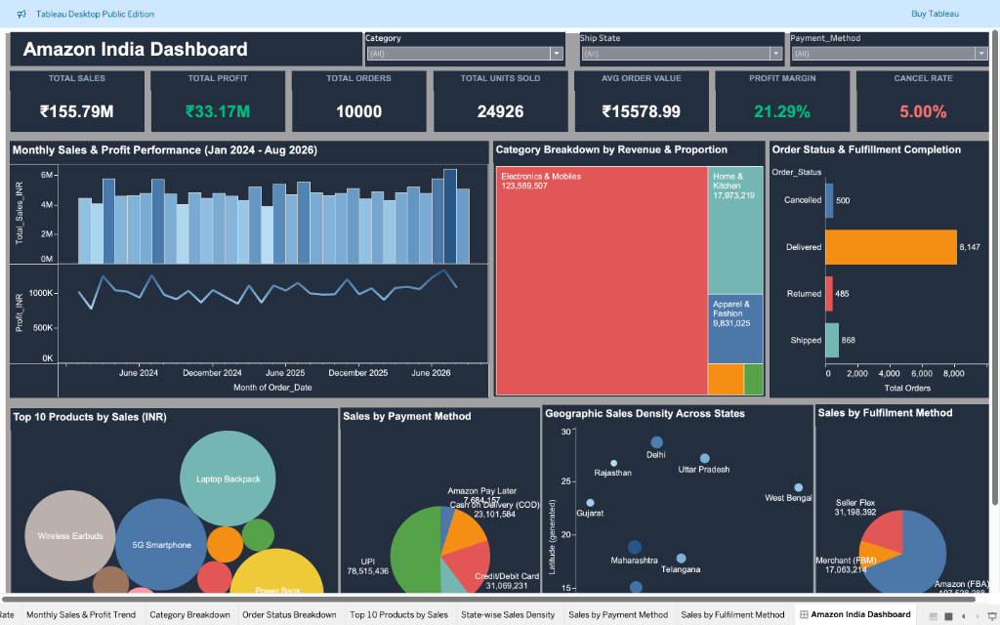

# Amazon India Sales - Executive Tableau Dashboard

An executive-level interactive business intelligence dashboard analyzing Amazon India e-commerce operations, revenue drivers, product profitability, fulfillment methods, and customer order fulfillment patterns.

[](https://public.tableau.com/)
[](LICENSE)

---

## 🔗 Live Interactive Dashboard

👉 **[View Live Dashboard on Tableau Public](https://public.tableau.com/)** *(Paste your published Tableau Public link here)*

> **Note**: To interact with dynamic filters, tooltips, and slicers directly in your web browser without downloading software, click the link above.

---

## 📊 Dashboard Preview



---

## 🚀 Key Highlights & Business KPIs

- **Total Sales Revenue**: ₹155.79M across all fulfilled and shipped categories.
- **Total Net Profit**: ₹33.17M generated across product catalog.
- **Profit Margin**: 21.29% overall operating margin.
- **Total Orders**: 10,000 unique orders analyzed across India.
- **Units Sold**: 24,926 total quantity sold.
- **Average Order Value (AOV)**: ₹15,578.99 per customer order.
- **Order Fulfillment**: Detailed breakdown across Delivered, Shipped, Cancelled, and Returned packages.

---

## 📈 Visualizations Included

1. **KPI Scorecard Header**: Quick glance metrics tracking top-level health indicators.
2. **Monthly Sales & Profit Trend**: Dual-axis combination chart (Revenue bars & Net Profit trendline) across monthly cohorts.
3. **Category Breakdown**: Treemap analyzing proportion of sales revenue by product segment.
4. **Order Status & Fulfillment**: Bar breakdown comparing completed vs cancelled/returned volumes.
5. **Top 10 Products by Sales**: Bubble distribution of best-selling inventory items.
6. **State-Wise Sales Density**: Geographic visualization of geographic order volume across Indian states.
7. **Sales by Payment Method**: High-contrast pie chart displaying distribution between UPI, Credit/Debit, Cash on Delivery, Net Banking, and Amazon Pay Later.
8. **Sales by Fulfilment Method**: High-contrast pie chart examining sales split between Amazon FBA, Seller Flex, and Merchant (FBM).

---

## 📁 Repository Structure

```
├── Amazon_India_Executive_Dashboard_final.twbx   # Complete packaged Tableau workbook (with extract)
├── data/
│   └── Amazon Sales Data India.xlsx              # Underlying source dataset
├── assets/
│   └── amazon_india_dashboard_preview.png                     # High-resolution dashboard screenshot
└── README.md                                     # Project documentation
```

---

## 💻 How to View & Explore Locally

1. **Prerequisites**: Download and install [Tableau Desktop](https://www.tableau.com/products/desktop) or the free [Tableau Public Desktop](https://www.tableau.com/products/public/download).
2. **Clone the repository**:
   ```bash
   git clone https://github.com/ayazgouri875/amazon-india-tableau-dashboard.git
   cd amazon-india-tableau-dashboard
   ```
3. **Open the Workbook**:
   - Double-click `Amazon_India_Executive_Dashboard_final.twbx` to open and inspect the calculations, sheets, and dashboard layouts directly.

---

## 👤 Author

- **Ayaz Gouri**
- GitHub: [@ayazgouri875](https://github.com/ayazgouri875)
